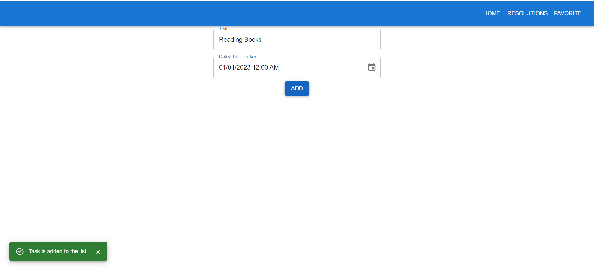
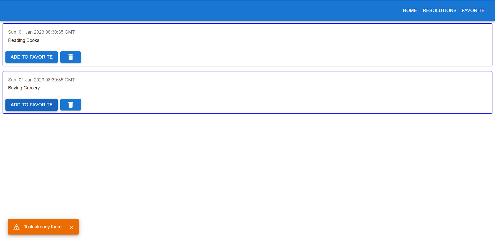
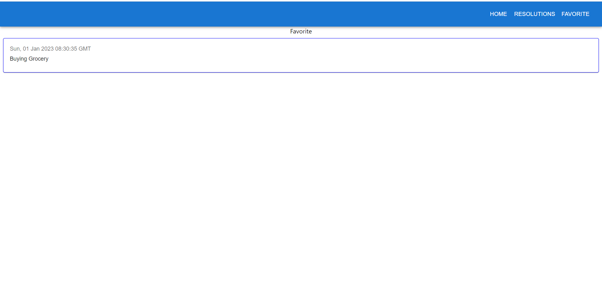

## Requirements

1. Create a form for the user to insert the resolution
2. It should have at least name and date
3. The user can remove the item in the resolution list
4. When the user add the same item in the favorite list, it should show warning to user.

## Screenshots
Home page

Resolutions list(to do list)

Favorite

